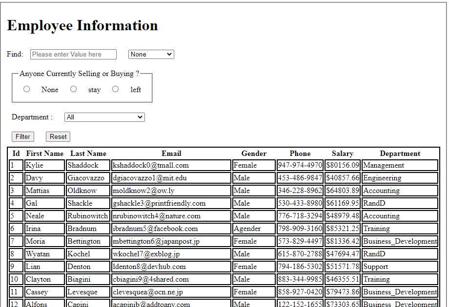
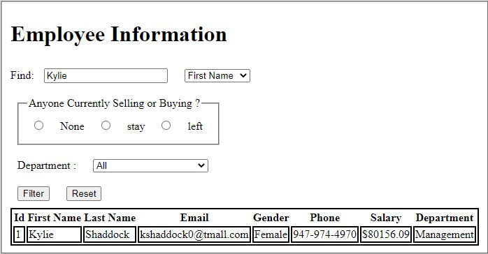
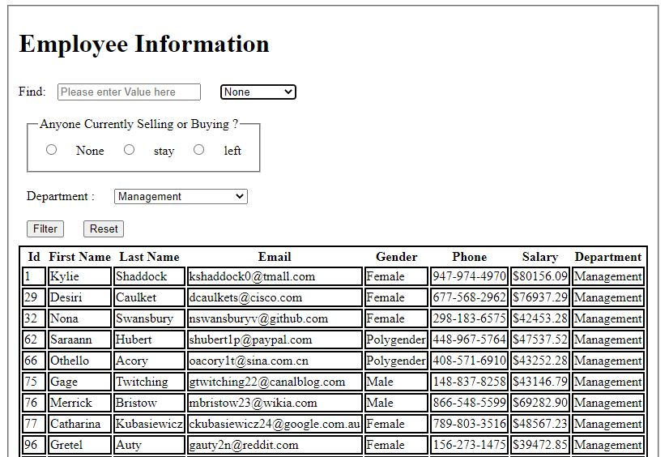
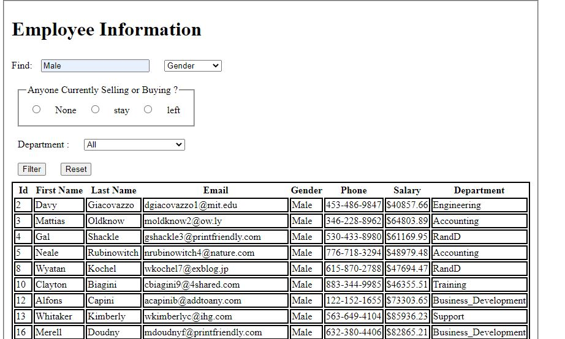

# Project 2
# Raj Chauhan
# N01494277
# Employee Information

## Direct link to visit page
- https://soft-boba-8b5bd4.netlify.app/

- I generated data or a JSON file from https://www.mockaroo.com/ and received with 8 fields.
- Created html form according to fields.
- Created emp.js file , get all employee details from MOCK_DATA.json
- Then I created employee.js file ,where I included all filters.

- So here is my page below...

## Logic
- getAllemployees function accepts multiple parameters and filters the data based on those parameters.
- getemployeeById function accepts employeeId as a parameter and returns employees with the provided Id.

## Structure
- api folder contains employee.js file.
- data folder has the data file from where the data is fetched
- html folder cotain html & emp files
- main.js file is responsible for loading the data.
- server.js is for setting up npm server.

## Use any field to filter.

- user has None, id, Firstname, Lastname, Email, Gender, salary, department.
- As a result, the user can search by any of the above fields by entering a value in the textbox shown below.

- filter by firstname

- filter by departments

- filter by gender

- filter by radio button
  I Tried but I can't completed properly, data can't displayed.
