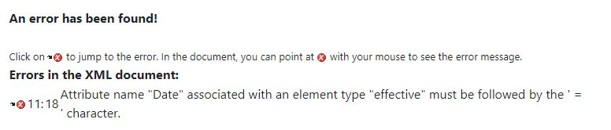
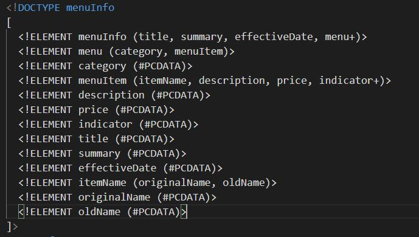
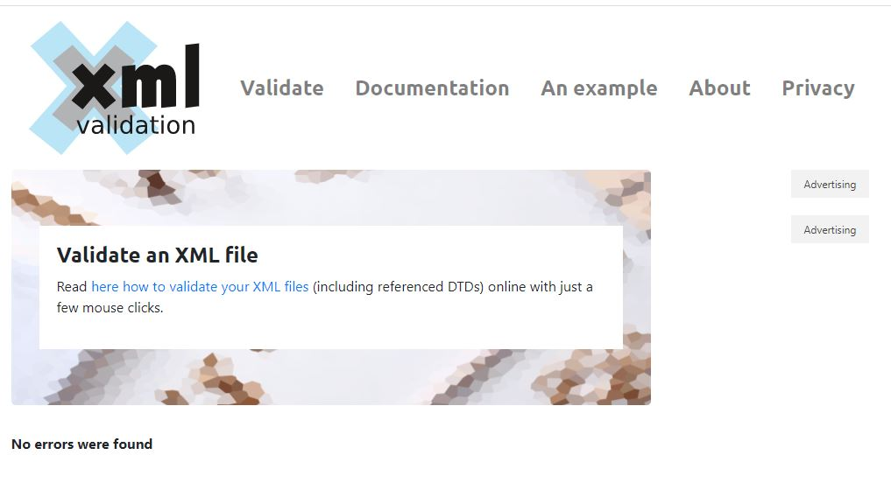

1.  

    Attriute error in <effectivedate> tag.
    The correct tag format is <effectivedate></effectivedate> 

2. In CDDATA, the text are not considered as markup. Parser can not parse it in XML Document.

3. 

4.  Prolog: <?xml version="1.0" encoding="UTF-8" standalone="yes" ?> 

Document Body: 
all Tags in XML file are called document Body.

Epilog: 
<?xml-stylesheet type="text/css" href="style.css"?>

5. 

6. 

7. added style.css

