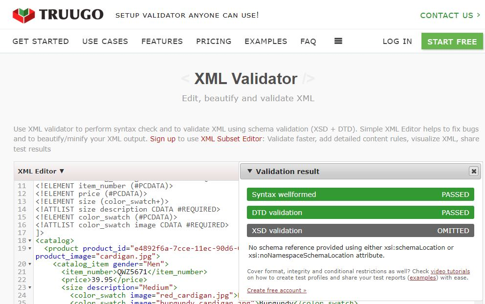
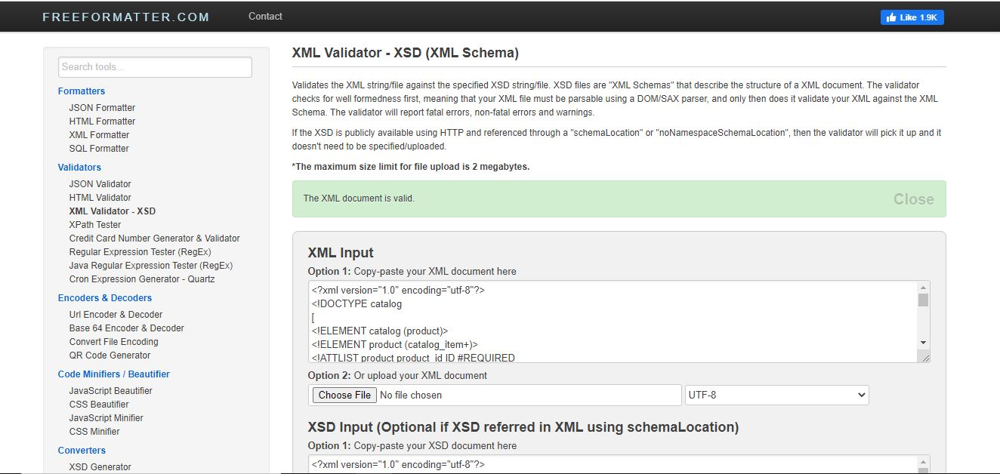

# Assignment 2

1. Did

2. 

3. 

4. As per my knowledge and based on assignments I have completed DTD is less preferred compared to XSD because of many reasons. DTD file does not allow for reusability of code. XSD, on the other hand, permits us to use items from other namespaces. XSD is also extensible and XSD supports user defined datatypes, i.e., it can have different datatypes like string, decimal, float, boolean as per usage. And DTD supports only one type to store data i.e., string type. The Most likely thing of XSD is that it is very simple and easy to learn whereas DTD is bit complicated.