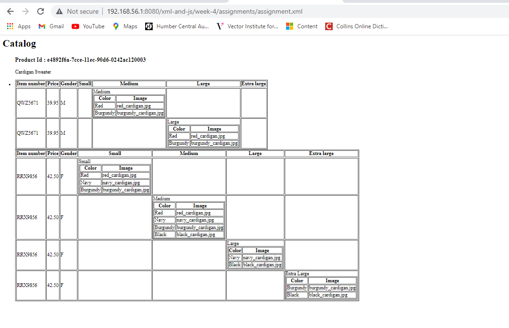

# week4-Assignment

1. 

- XSL style sheets can be created and used to affect how XML documents are displayed.

- The following attributes are included in XSL:
    XSLT is a transformation language for XML documents.
    XPath, a language for specifying parts of an XML document.

- In the assignment XSL File, I have rendered all data in table format. Xml file contains data & xsl file contain table format.
   